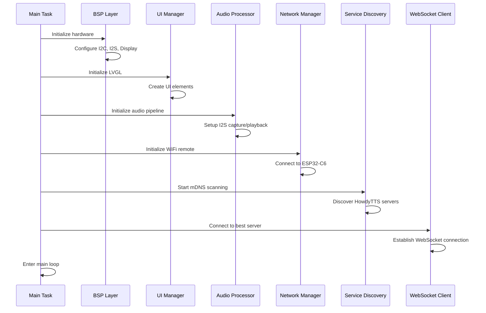
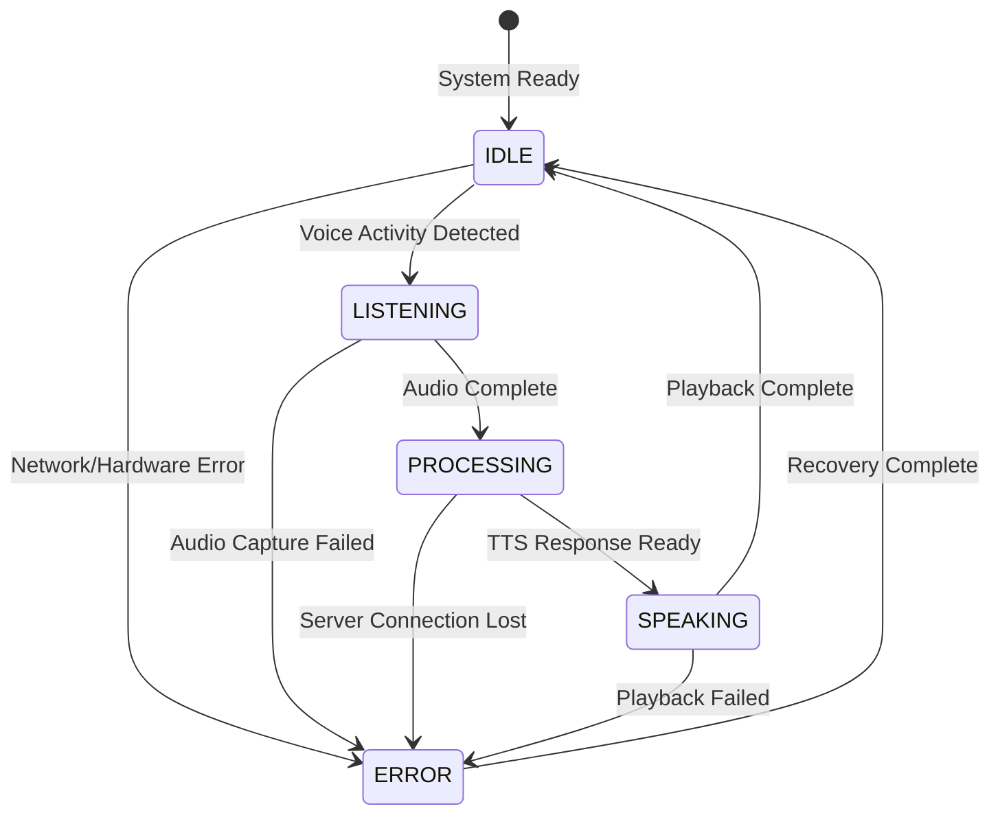

# ESP32-P4 HowdyScreen Architecture Documentation

## Project Overview

The ESP32-P4 HowdyScreen is a real-time voice assistant interface featuring a dual-chip architecture with ESP32-P4 as the main processor and ESP32-C6 as the WiFi co-processor. The system provides a circular LCD touchscreen interface for interaction with HowdyTTS (Text-to-Speech) services over WiFi networks.

## System Architecture

### Dual-Chip Configuration

```
┌─────────────────────┐    SDIO    ┌─────────────────────┐
│     ESP32-P4        │◄──────────►│     ESP32-C6        │
│   Main Processor    │            │  WiFi Co-processor  │
│                     │            │                     │
│ - RISC-V Dual Core  │            │ - WiFi 6 Support    │
│ - LCD/Touch Control │            │ - 2.4GHz Only       │
│ - Audio Processing  │            │ - Network Stack     │
│ - LVGL UI           │            │ - mDNS Services     │
│ - Real-time Tasks   │            │ - WebSocket Client  │
└─────────────────────┘            └─────────────────────┘
           │                                  │
           ▼                                  ▼
    ┌─────────────────┐              ┌──────────────────┐
    │  Peripherals    │              │    Network       │
    │                 │              │                  │
    │ - 800x800 LCD   │              │ - HowdyTTS       │
    │ - CST9217 Touch │              │ - mDNS Discovery │
    │ - ES8311 Codec  │              │ - WebSocket      │
    │ - I2S Audio     │              │ - UDP Streaming  │
    │ - SD Card       │              │ - HTTP Status    │
    └─────────────────┘              └──────────────────┘
```

### Component Architecture

The system is organized into 5 primary components with clear separation of concerns:

#### 1. BSP (Board Support Package)
- **Purpose**: Hardware abstraction layer for ESP32-P4-WiFi6-Touch-LCD-XC
- **Responsibilities**:
  - GPIO pin mapping and configuration
  - I2C bus management (codec + touch)
  - MIPI-DSI display initialization
  - I2S audio interface setup
  - SD card interface
  - Power management

#### 2. Audio Processor
- **Purpose**: Real-time audio capture, processing, and playback
- **Responsibilities**:
  - I2S audio capture from ES8311 codec
  - Audio buffer management and DMA
  - Voice activity detection
  - Audio level monitoring
  - Playback pipeline for TTS responses

#### 3. UI Manager
- **Purpose**: LVGL-based user interface and state management
- **Responsibilities**:
  - Circular UI design for round display
  - Touch event handling
  - Audio level visualization
  - Status display and animations
  - State machine for UI states

#### 4. WebSocket Client
- **Purpose**: HowdyTTS protocol implementation
- **Responsibilities**:
  - WebSocket connection management
  - Audio streaming protocol
  - Binary audio data handling
  - Connection recovery and keepalive
  - Protocol state management

#### 5. Service Discovery
- **Purpose**: Automatic HowdyTTS server detection
- **Responsibilities**:
  - mDNS service discovery
  - Server capability detection
  - Connection quality testing
  - Automatic failover handling

## System Integration Flow

### Startup Sequence



### Voice Assistant Workflow



## Hardware Interface Configuration

### Pin Mapping (ESP32-P4-WiFi6-Touch-LCD-XC)

| Function | GPIO | Description |
|----------|------|-------------|
| **I2C Interface** |
| I2C_SDA | GPIO_7 | I2C data line (codec + touch) |
| I2C_SCL | GPIO_8 | I2C clock line |
| **Audio Interface** |
| I2S_MCLK | GPIO_13 | Master clock to ES8311 |
| I2S_SCLK | GPIO_12 | Bit clock |
| I2S_LCLK | GPIO_10 | Word select (LR clock) |
| I2S_DOUT | GPIO_9 | Audio data out (playback) |
| I2S_DSIN | GPIO_11 | Audio data in (capture) |
| POWER_AMP | GPIO_53 | Audio amplifier enable |
| **Display Interface** |
| LCD_BACKLIGHT | GPIO_26 | Backlight PWM control |
| LCD_RST | GPIO_27 | Display reset |
| LCD_TOUCH_RST | GPIO_23 | Touch controller reset |
| **SDIO Interface (ESP32-C6)** |
| SDIO_CLK | GPIO_36 | SDIO clock |
| SDIO_CMD | GPIO_37 | SDIO command |
| SDIO_D0 | GPIO_35 | SDIO data 0 |
| SDIO_D1 | GPIO_34 | SDIO data 1 |
| SDIO_D2 | GPIO_33 | SDIO data 2 |
| SDIO_D3 | GPIO_48 | SDIO data 3 |
| C6_RESET | GPIO_47 | ESP32-C6 reset control |
| **SD Card Interface** |
| SD_D0 | GPIO_39 | SD card data 0 |
| SD_D1 | GPIO_40 | SD card data 1 |
| SD_D2 | GPIO_41 | SD card data 2 |
| SD_D3 | GPIO_42 | SD card data 3 |
| SD_CMD | GPIO_44 | SD card command |
| SD_CLK | GPIO_43 | SD card clock |

### Power and Clock Configuration

```
System Clock: 240 MHz (ESP32-P4)
MIPI Clock: 80 MHz (Display)
I2S Clock: 16 kHz sample rate, 16-bit
I2C Clock: 400 kHz (Fast mode)
SDIO Clock: 40 MHz (High speed mode)
```

## Memory Architecture

### Memory Layout

```
┌─────────────────────────────────────────────────────────────┐
│                    ESP32-P4 Memory Map                     │
├─────────────────────────────────────────────────────────────┤
│ IRAM (512 KB)           │ Code execution, ISRs           │
│ DRAM (512 KB)           │ Variables, heap, stacks        │
│ PSRAM (8 MB available)  │ LVGL buffers, audio buffers    │
│ Flash (16 MB)           │ Application, assets, config    │
└─────────────────────────────────────────────────────────────┘
```

### Buffer Allocation Strategy

- **LVGL Display Buffer**: 1600 pixels × 2 bytes = 3.2 KB (PSRAM)
- **Audio Capture Buffer**: 2048 samples × 2 bytes × 2 buffers = 8 KB (DMA-capable DRAM)
- **Audio Playback Buffer**: 2048 samples × 2 bytes × 2 buffers = 8 KB (DMA-capable DRAM)
- **WebSocket Buffer**: 2048 bytes (DRAM)
- **Network Buffers**: 4 KB total (DRAM)

## Real-Time Performance Requirements

### Critical Timing Constraints

| Component | Requirement | Implementation |
|-----------|-------------|----------------|
| Audio Capture | < 50ms latency | DMA + Ring buffers |
| Audio Playback | < 50ms latency | DMA + Pre-buffering |
| Display Refresh | 60 FPS | MIPI-DSI + Frame buffer |
| Touch Response | < 16ms | Interrupt-driven |
| Network Keepalive | 30s intervals | Timer-based |
| UI Updates | 100ms max | State-driven updates |

### FreeRTOS Task Priority Configuration

```c
// High priority (audio/network critical)
#define AUDIO_CAPTURE_TASK_PRIORITY     23
#define AUDIO_PLAYBACK_TASK_PRIORITY    22
#define NETWORK_TASK_PRIORITY           21

// Medium priority (UI/control)
#define LVGL_TASK_PRIORITY              20
#define WEBSOCKET_TASK_PRIORITY         19
#define SERVICE_DISCOVERY_PRIORITY      18

// Low priority (background/housekeeping)
#define SYSTEM_MONITOR_PRIORITY         10
#define LOGGING_TASK_PRIORITY           5
```

## Error Handling and Recovery

### Error Categories

1. **Hardware Errors**
   - I2C communication failures
   - Audio codec initialization
   - Display initialization
   - Touch controller failures

2. **Network Errors**
   - WiFi connection loss
   - Server discovery failures
   - WebSocket disconnection
   - UDP packet loss

3. **System Errors**
   - Memory allocation failures
   - Task creation failures
   - DMA buffer overruns
   - Stack overflow

### Recovery Strategies

```c
typedef enum {
    RECOVERY_NONE = 0,
    RECOVERY_RETRY,
    RECOVERY_RESET_COMPONENT,
    RECOVERY_SYSTEM_RESTART
} recovery_action_t;

typedef struct {
    esp_err_t error_code;
    const char* component_name;
    recovery_action_t action;
    uint32_t retry_count;
    uint32_t max_retries;
} error_recovery_t;
```

## Performance Optimization

### Audio Pipeline Optimization

1. **DMA Configuration**
   - Use 2048-sample buffers for optimal latency/stability balance
   - Enable auto-clear on buffer underrun
   - Configure for 16-bit mono at 16 kHz

2. **Buffer Management**
   - Ring buffer implementation for continuous capture
   - Double buffering for playback
   - Memory alignment for DMA efficiency

3. **Processing Optimization**
   - Voice activity detection to reduce network traffic
   - Audio level calculation using efficient algorithms
   - Minimal processing in ISR context

### Display Performance

1. **LVGL Configuration**
   - Reduced buffer size for memory efficiency
   - Hardware acceleration where available
   - Optimized redraw regions

2. **Touch Handling**
   - Interrupt-driven touch detection
   - Debouncing in software
   - Gesture recognition optimization

### Network Optimization

1. **Connection Management**
   - Automatic reconnection with exponential backoff
   - Connection pooling for multiple servers
   - Keepalive optimization

2. **Data Transfer**
   - Binary protocol for audio streaming
   - Compression where beneficial
   - Packet prioritization

## Security Considerations

### Network Security

1. **WiFi Security**
   - WPA2/WPA3 encryption support
   - Certificate validation for secure connections
   - Network credential protection

2. **Communication Security**
   - TLS support for WebSocket connections
   - Audio data encryption options
   - Server authentication

### System Security

1. **Memory Protection**
   - Stack overflow detection
   - Heap corruption detection
   - Secure boot options

2. **Access Control**
   - Configuration protection
   - Debug interface security
   - Firmware update security

## Development and Debugging

### Build System

```cmake
# Component dependencies
target_link_libraries(${COMPONENT_LIB} INTERFACE
    bsp
    audio_processor
    ui_manager
    websocket_client
    service_discovery
)
```

### Debug Features

1. **Logging System**
   - Component-specific log levels
   - Network debug information
   - Performance metrics logging

2. **Diagnostic Tools**
   - Audio pipeline monitoring
   - Network connectivity tests
   - Display/touch diagnostics
   - Memory usage monitoring

3. **Development Aids**
   - Component test applications
   - Hardware validation scripts
   - Performance profiling tools

## Maintenance and Updates

### Component Versioning

Each component maintains version compatibility:
```c
#define AUDIO_PROCESSOR_VERSION "1.2.0"
#define UI_MANAGER_VERSION "1.1.0"
#define WEBSOCKET_CLIENT_VERSION "1.0.1"
```

### Update Procedures

1. **Over-the-Air Updates**
   - Secure firmware delivery
   - Rollback capability
   - Configuration preservation

2. **Component Updates**
   - Individual component updates
   - Dependency validation
   - Configuration migration

This architecture provides a robust, scalable foundation for real-time voice assistant applications on the ESP32-P4 platform with clear separation of concerns and optimal performance characteristics.