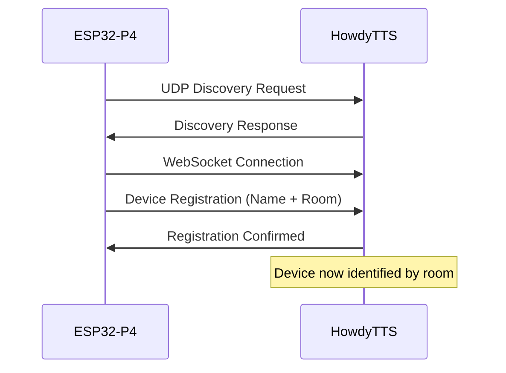

# ESP32-P4 HowdyScreen Room Configuration Guide

## 🏠 **Room Assignment Overview**

The ESP32-P4 HowdyScreen now supports **room-based identification** allowing you to:
- Target specific rooms with voice commands
- Organize multiple ESP32-P4 devices by location
- Monitor device status per room in HowdyTTS server

---

## 📋 **Quick Setup Steps**

### **1. Configure ESP32-P4 Room Settings**

Use the ESP-IDF menuconfig system to set your device's room and name:

```bash
cd /Users/silverlinings/Desktop/Coding/ESP32P4/HowdyScreen
idf.py menuconfig
```

Navigate to:
```
HowdyScreen Configuration → Device Configuration
```

**Set these values:**
- **Room Name**: `Living Room`, `Kitchen`, `Bedroom`, `Office`, etc.
- **Device Name**: `Kitchen Display`, `Main Screen`, `Bedroom Assistant`, etc.

### **2. Build and Flash Firmware**

```bash
idf.py build
idf.py flash
```

### **3. Start HowdyTTS Server with Room Targeting**

```bash
# Target specific room
python run_voice_assistant.py --wireless --room "Living Room"

# Auto-detect any wireless device
python run_voice_assistant.py --wireless

# List available devices and their rooms
python run_voice_assistant.py --list-devices
```

---

## 🔧 **Available Room Configuration Options**

### **In ESP-IDF menuconfig:**

| Setting | Description | Example Values |
|---------|-------------|----------------|
| **Room Name** | Physical location of device | `Living Room`, `Kitchen`, `Bedroom`, `Office`, `Den` |
| **Device Name** | Descriptive name for device | `Kitchen Display`, `Main Screen`, `Bedroom Assistant` |

### **Default Values:**
- **Room Name**: `Living Room`
- **Device Name**: `HowdyScreen`

---

## 📡 **How Room Assignment Works**

### **🎯 Device Registration Flow:**



### **📱 Device Identification Protocol:**

When ESP32-P4 connects to HowdyTTS via WebSocket, it sends:
```json
{
  "type": "device_registration",
  "device_name": "Kitchen Display",
  "room": "Kitchen",
  "firmware_version": "1.0.0",
  "capabilities": {
    "audio_capture": true,
    "tts_playback": true,
    "wake_word_detection": true
  }
}
```

---

## 🎯 **Using Room-Targeted Voice Commands**

### **Start HowdyTTS Server for Specific Room:**

```bash
# Connect to Kitchen devices only
python run_voice_assistant.py --wireless --room "Kitchen"

# Connect to Bedroom devices only
python run_voice_assistant.py --wireless --room "Bedroom"

# Connect to any available wireless device
python run_voice_assistant.py --wireless
```

### **List Available Devices by Room:**

```bash
python run_voice_assistant.py --list-devices
```

**Example output:**
```
Available wireless devices:
  0: Kitchen Display (Kitchen) - 192.168.1.101
  1: Bedroom Assistant (Bedroom) - 192.168.1.102
  2: Office Screen (Office) - 192.168.1.103
```

---

## ⚙️ **Configuration File Locations**

### **ESP32-P4 Firmware Configuration:**
- **Kconfig**: `/main/Kconfig.projbuild` (lines 49-65)
- **Main App**: `/main/howdy_phase6_howdytts_integration.c`
- **Build Config**: Generated in `sdkconfig` after menuconfig

### **HowdyTTS Server Configuration:**
- **Device Registry**: Auto-generated `wireless_devices.json`
- **WebSocket Server**: `voice_assistant/websocket_tts_server.py`
- **Network Audio**: `voice_assistant/network_audio_source.py`

---

## 🧪 **Testing Room Configuration**

### **1. Test ESP32-P4 Configuration:**

Run the integration test suite:
```bash
cd /Users/silverlinings/Desktop/Coding/RBP/HowdyTTS
python tools/test_esp32p4_integration.py --room "Living Room"
```

### **2. Verify Room Assignment:**

Check device registration in HowdyTTS logs:
```
📱 Device registration from esp32p4_192_168_1_101: Kitchen Display in Kitchen
✅ Registered ESP32-P4: Kitchen Display (Kitchen)
```

### **3. Test Room-Specific Connection:**

```bash
# This should only connect to Kitchen devices
python run_voice_assistant.py --wireless --room "Kitchen"
```

**Expected output:**
```
🎯 Wireless Mode - Waiting for ESP32-P4 HowdyScreen...
Target room: Kitchen
✅ ESP32-P4 device connected!
Connected ESP32-P4 devices:
  • Kitchen Display: 192.168.1.101
```

---

## 🔍 **Troubleshooting Room Configuration**

### **Common Issues:**

**1. Device not showing correct room:**
- Verify menuconfig settings were saved
- Rebuild and reflash firmware: `idf.py build flash`
- Check WebSocket connection logs

**2. HowdyTTS not finding room-specific devices:**
- Ensure device is connected to same WiFi network
- Check room name spelling (case-sensitive)
- Try `--list-devices` to see all available devices

**3. Multiple devices in same room:**
- Each device needs unique Device Name
- Room Name can be the same for multiple devices
- Server will connect to first available device in target room

### **Debug Commands:**

```bash
# Check device discovery
python run_voice_assistant.py --list-devices

# Test specific room targeting
python tools/test_esp32p4_integration.py --room "YourRoomName" --verbose

# Monitor WebSocket connections
python run_voice_assistant.py --wireless --room "YourRoom"
# Watch logs for device registration messages
```

---

## 📝 **Configuration Examples**

### **Kitchen Setup:**
```c
// In ESP-IDF menuconfig:
CONFIG_HOWDY_DEVICE_ROOM="Kitchen"
CONFIG_HOWDY_DEVICE_NAME="Kitchen Display"
```

```bash
# Start server for Kitchen
python run_voice_assistant.py --wireless --room "Kitchen"
```

### **Multi-Room Setup:**

**Living Room ESP32-P4:**
```c
CONFIG_HOWDY_DEVICE_ROOM="Living Room"
CONFIG_HOWDY_DEVICE_NAME="Main Screen"
```

**Bedroom ESP32-P4:**
```c
CONFIG_HOWDY_DEVICE_ROOM="Bedroom"
CONFIG_HOWDY_DEVICE_NAME="Bedroom Assistant"
```

**Server Usage:**
```bash
# Connect to Living Room
python run_voice_assistant.py --wireless --room "Living Room"

# Connect to Bedroom
python run_voice_assistant.py --wireless --room "Bedroom"

# Connect to any available device
python run_voice_assistant.py --auto
```

---

## ✅ **Summary**

Your ESP32-P4 HowdyScreen now supports **complete room-based configuration**:

1. **✅ ESP32-P4 Menuconfig**: Added `HOWDY_DEVICE_ROOM` and `HOWDY_DEVICE_NAME` settings
2. **✅ Device Registration**: ESP32-P4 sends room info via WebSocket to HowdyTTS server  
3. **✅ Server Integration**: HowdyTTS parses and uses room information for device targeting
4. **✅ Room-Specific Commands**: Start server with `--room "Room Name"` to target specific rooms
5. **✅ Device Listing**: Use `--list-devices` to see all devices with their room assignments

**Next Steps:**
1. Run `idf.py menuconfig` to set your room and device name
2. Build and flash: `idf.py build flash`
3. Test with: `python run_voice_assistant.py --wireless --room "YourRoomName"`

Your ESP32-P4 voice assistant is now **room-aware** and ready for multi-device deployments! 🎉